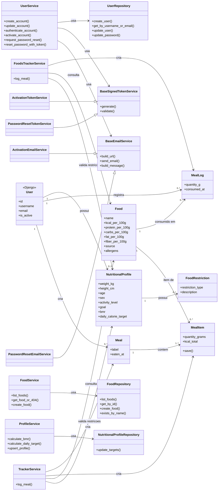

# Diagrama de Classes (Principais Classes)

```mermaid
classDiagram
    direction LR

    class User {
        <<Django>>
        +id
        +username
        +email
        +is_active
    }

    class Food {
        +name
        +kcal_per_100g
        +protein_per_100g
        +carbs_per_100g
        +fat_per_100g
        +fiber_per_100g
        +source
        +allergens
    }

    class MealLog {
        +quantity_g
        +consumed_at
    }

    class NutritionalProfile {
        +weight_kg
        +height_cm
        +age
        +sex
        +activity_level
        +goal
        +bmr
        +daily_calorie_target
    }

    class FoodRestriction {
        +restriction_type
        +description
    }

    class Meal {
        +label
        +eaten_at
    }

    class MealItem {
        +quantity_grams
        +kcal_total
        +save()
    }

    class UserRepository {
        +create_user()
        +get_by_username_or_email()
        +update_user()
        +update_password()
    }

    class UserService {
        +create_account()
        +update_account()
        +authenticate_account()
        +activate_account()
        +request_password_reset()
        +reset_password_with_token()
    }

    class BaseSignedTokenService {
        +generate()
        +validate()
    }

    class ActivationTokenService
    class PasswordResetTokenService

    class BaseEmailService {
        +build_url()
        +send_email()
        +build_message()
    }

    class ActivationEmailService
    class PasswordResetEmailService

    class FoodRepository {
        +list_foods()
        +get_by_id()
        +create_food()
        +exists_by_name()
    }

    class FoodService {
        +list_foods()
        +get_food_or_404()
        +create_food()
    }

    class NutritionalProfileRepository {
        +update_targets()
    }

    class ProfileService {
        +calculate_bmr()
        +calculate_daily_target()
        +upsert_profile()
    }

    class FoodsTrackerService {
        +log_meal()
    }

    class TrackerService {
        +log_meal()
    }

    User "1" --> "0..1" NutritionalProfile : possui
    NutritionalProfile "1" --> "0..*" FoodRestriction : possui

    User "1" --> "0..*" MealLog : registra
    Food "1" --> "0..*" MealLog : consumido em

    User "1" --> "0..*" Meal : cria
    Meal "1" --> "1..*" MealItem : contem
    Food "1" --> "0..*" MealItem : item de

    UserService --> UserRepository : usa
    UserService --> BaseSignedTokenService : usa
    UserService --> BaseEmailService : usa

    ActivationTokenService --|> BaseSignedTokenService
    PasswordResetTokenService --|> BaseSignedTokenService
    ActivationEmailService --|> BaseEmailService
    PasswordResetEmailService --|> BaseEmailService

    FoodService --> FoodRepository : usa
    ProfileService --> NutritionalProfileRepository : usa

    FoodsTrackerService --> MealLog : cria
    FoodsTrackerService --> Food : consulta
    FoodsTrackerService --> NutritionalProfile : valida restricoes

    TrackerService --> Meal : cria
    TrackerService --> MealItem : cria
    TrackerService --> Food : consulta
    TrackerService --> NutritionalProfile : valida restricoes
```
