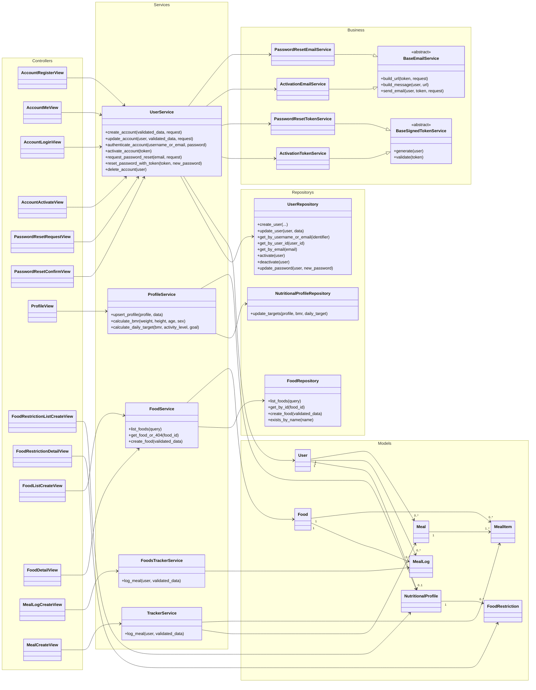

# Diagrama de Classes - Sprint 1 (Mermaid)

```mermaid
classDiagram
  direction LR

  namespace Controllers {
    class AccountRegisterView
    class AccountMeView
    class AccountLoginView
    class AccountActivateView
    class PasswordResetRequestView
    class PasswordResetConfirmView

    class ProfileView
    class FoodRestrictionListCreateView
    class FoodRestrictionDetailView

    class FoodListCreateView
    class FoodDetailView
    class MealLogCreateView

    class MealCreateView
  }

  namespace Services {
    class UserService {
      +create_account(validated_data, request)
      +update_account(user, validated_data, request)
      +authenticate_account(username_or_email, password)
      +activate_account(token)
      +request_password_reset(email, request)
      +reset_password_with_token(token, new_password)
      +delete_account(user)
    }

    class ProfileService {
      +upsert_profile(profile, data)
      +calculate_bmr(weight, height, age, sex)
      +calculate_daily_target(bmr, activity_level, goal)
    }

    class FoodService {
      +list_foods(query)
      +get_food_or_404(food_id)
      +create_food(validated_data)
    }

    class FoodsTrackerService {
      +log_meal(user, validated_data)
    }

    class TrackerService {
      +log_meal(user, validated_data)
    }
  }

  namespace Repositorys {
    class UserRepository {
      +create_user(...)
      +update_user(user, data)
      +get_by_username_or_email(identifier)
      +get_by_user_id(user_id)
      +get_by_email(email)
      +activate(user)
      +deactivate(user)
      +update_password(user, new_password)
    }

    class FoodRepository {
      +list_foods(query)
      +get_by_id(food_id)
      +create_food(validated_data)
      +exists_by_name(name)
    }

    class NutritionalProfileRepository {
      +update_targets(profile, bmr, daily_target)
    }
  }

  namespace Models {
    class User
    class NutritionalProfile
    class FoodRestriction
    class Food
    class MealLog
    class Meal
    class MealItem
  }

  namespace Business {
    class BaseSignedTokenService {
      <<abstract>>
      +generate(user)
      +validate(token)
    }

    class ActivationTokenService
    class PasswordResetTokenService

    class BaseEmailService {
      <<abstract>>
      +build_url(token, request)
      +build_message(user, url)
      +send_email(user, token, request)
    }

    class ActivationEmailService
    class PasswordResetEmailService
  }

  AccountRegisterView --> UserService
  AccountMeView --> UserService
  AccountLoginView --> UserService
  AccountActivateView --> UserService
  PasswordResetRequestView --> UserService
  PasswordResetConfirmView --> UserService

  ProfileView --> ProfileService
  FoodRestrictionListCreateView --> NutritionalProfile
  FoodRestrictionDetailView --> FoodRestriction

  FoodListCreateView --> FoodService
  FoodDetailView --> FoodService
  MealLogCreateView --> FoodsTrackerService
  MealCreateView --> TrackerService

  UserService --> UserRepository
  FoodService --> FoodRepository
  ProfileService --> NutritionalProfileRepository

  UserService --> User
  ProfileService --> NutritionalProfile
  FoodService --> Food
  FoodsTrackerService --> MealLog
  TrackerService --> Meal
  TrackerService --> MealItem

  UserService --> ActivationTokenService
  UserService --> PasswordResetTokenService
  UserService --> ActivationEmailService
  UserService --> PasswordResetEmailService

  ActivationTokenService --|> BaseSignedTokenService
  PasswordResetTokenService --|> BaseSignedTokenService
  ActivationEmailService --|> BaseEmailService
  PasswordResetEmailService --|> BaseEmailService

  User "1" --> "0..1" NutritionalProfile
  NutritionalProfile "1" --> "0..*" FoodRestriction
  User "1" --> "0..*" MealLog
  Food "1" --> "0..*" MealLog
  User "1" --> "0..*" Meal
  Meal "1" --> "1..*" MealItem
  Food "1" --> "0..*" MealItem
```
